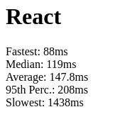
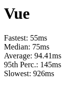
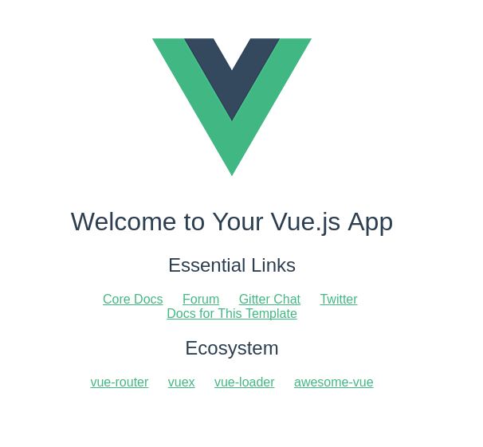
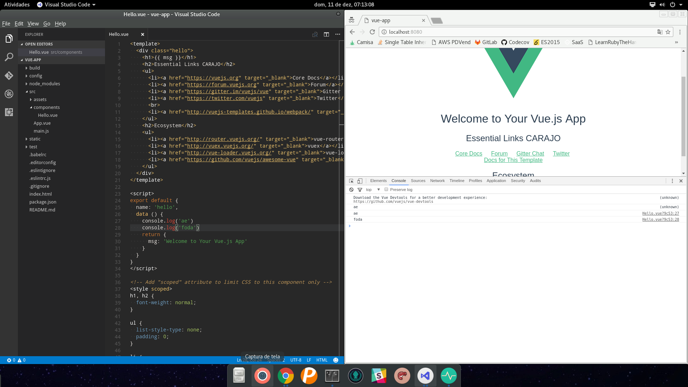
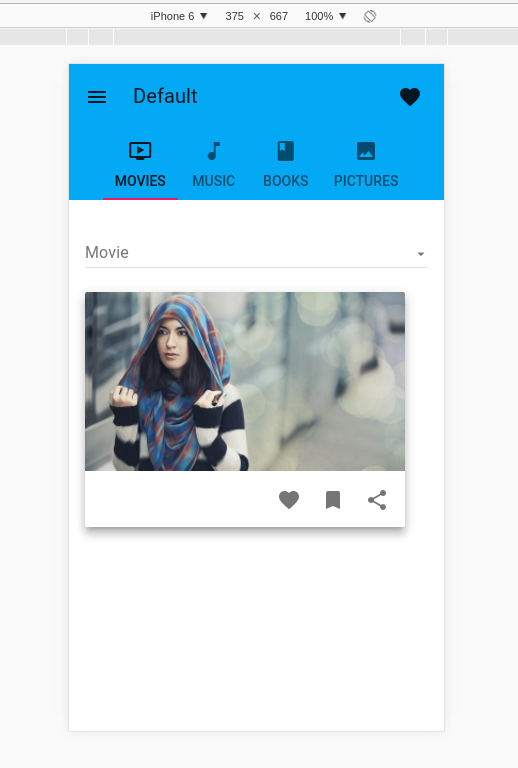
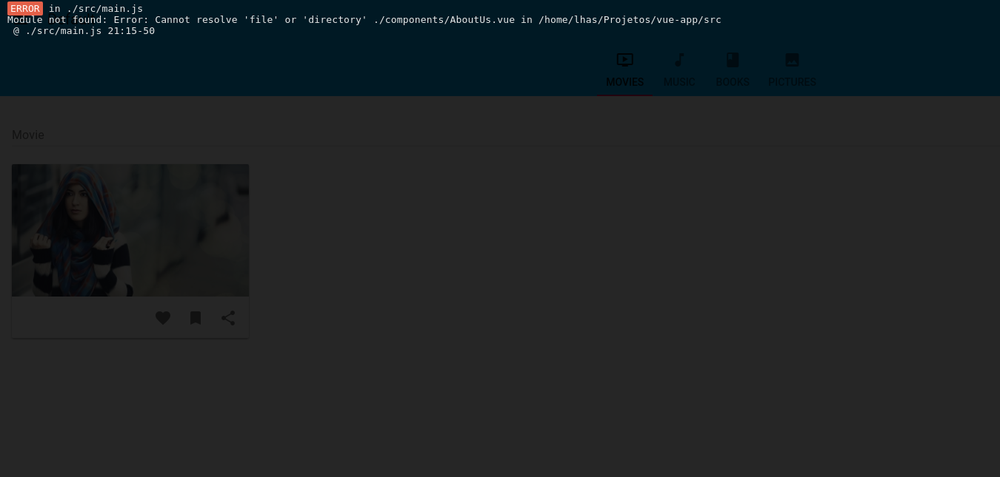
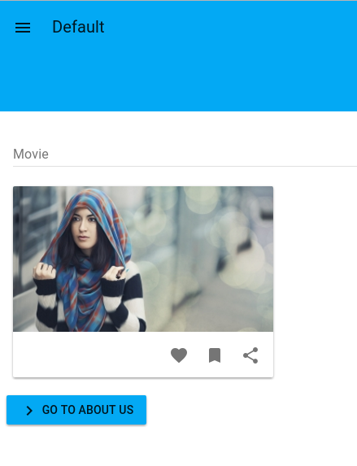
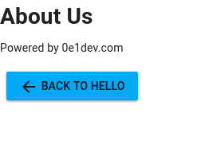

#  

Este mini-post fará parte de uma série de postagens que farei a respeito desta mais nova ferramenta para desenvolvimento de front-end, chamada [VueJS](https://vuejs.org/).

O Vue é tem tido um hype bem grande da comunidade JS, atrás dos famosos [React](https://facebook.github.io/react/) e [Angular 2](https://angular.io/). Porém, apesar de ocupar este "terceiro" lugar, a sua popularidade aumenta cada dia.

O motivo do aumento de sua popularidade se dá graças aos benefícios que este tipo de ferramenta proporciona em comparação as outras 2 ferramentas.

Se você quiser conhecer mais sobre a comparação do Vue com outras ferramentas, [veja esta página](https://vuejs.org/v2/guide/comparison.html) na documentação deles em que eles comparam com os principais frameworks do mercado.

# Benefícios

- Muito, muito, leve (17kb gzip)
- Aplicação de Virtual DOM extremamente eficiente (comparável ao React)
- Sintaxe simples
- Comunidade bem ativa

# Desvantagens

- Não é apoiado por uma grande corporação como Google e Facebook (é uma boa coisa dependendo do ponto de vista)
- Comunidade em menor número (em comparação aos outros 2)

# Performance

Existe um projeto no GitHub que compara o desempenho do Vue 2 com o React, e o resultado é promissor. Caso você queira rodar na sua máquina, [o projeto encontra-se aqui](https://github.com/chrisvfritz/vue-render-performance-comparisons).

O resultado na minha máquina foi:


*React*


*Vue*

# Instalação


Graças a equipe do Vue, nós temos um CLI que gera um projeto novo para gente com [Webpack](https://webpack.github.io/) (ou [Browserify](http://browserify.org/)), Hot Reload, Lint-on-save, e ainda faz build para produção.

É um dos CLI's mais interessantes que eu trabalhei nos ultimos meses se tratando de front-end. E como ele é bem modular, trabalhando sob conceito de templates, você pode criar o seu próprio template para novos projetos e assim extender o CLI as suas necessidades individuais.

Você pode começar um novo projeto em questão de minutos com todas as ferramentas mais modernas disponíveis.

Caso você queira ver o código-fonte do Vue-CLI, [clique aqui](https://github.com/vuejs/vue-cli).

Para instalá-lo, é muito simples. Você só precisa do NodeJS na sua máquina:

```bash
$ npm install -g vue-cli
```

# Criando novo projeto

Agora que temos nosso CLI disponível na máquina, vamos criar um novo projeto usando o template do Webpack que ele nos disponibiliza.  Caso você queira conhecer os templates disponíveis, [clique aqui](https://github.com/vuejs-templates).

```bash
$ vue init webpack vue-app
```

Ele vai fazer algumas perguntas como:
- se você quer ter uma camada de testes;
- se você deseja usar ESLint (super recomendo);
- entre outros.


PS: `vue-app` é opcional, você pode chamá-lo como quiser. Porém é uma convenção interessante usar o nome da principal tecnologia no nome do seu repositório como prefixo.

Agora vamos instalar as dependências e rodar o projeto. Para isto:

```bash
$ cd vue-app/
$ npm install
$ npm run dev
```

Seu browser deve abrir automaticamente esta página:



Este post poderia finalizar aqui, mas eu acho que esta etapa inicial é tão simples e gostosa de se por em prática, que merece incluir mais 2 sub-tópicos:

- Usando componentes em `Material Design`
- Usando rotas

Com esta base de `Routes` + `Material Design`, já dá para produzir muito app simples, prático, bonito e o mais importante, **leve**. Se tiver uma API para tu consumir alguns dados, melhor ainda.

Antes de começarmos a programar de fato, gostaria de esclarecer alguns aspectos que fazem o Vue ser tão poderoso:

## Estilização, Comportamento e Estrutura de Componentes em 1 arquivo

Como `talk is cheap`, vamos para o `code`:


Seriously. Vocês também concordam que esta estrutura é `FODA`?

As possibilidades são infinitas neste screenshot.

Você pode:

- Definir os `preprocessors` que você quiser (Pug/Jade, SASS, Stylus, etc etc)
- Implementar a view no mesmo arquivo da lógica
- Módulos em [CommonJS](https://webpack.github.io/docs/commonjs.html)
- Ter todo o CSS incluído na história
- Você pode opcionalmente fazer com que seu CSS seja `escopado` [(Veja mais sobre Scoped CSS)](https://github.com/vuejs/vue-loader/blob/master/docs/en/features/scoped-css.md)

Tudo isto com um maravilhoso `Hot Reload` já configurado que faz a mágica ser ainda mais intensa. O `create-react-app` até o momento não tem um HotReload como esse, ele dá 1 refresh na página igual BrowserSync.

Faça um teste você mesmo, divida sua tela em seu browser e seu editor preferido. Agora abra o arquivo `app/components/Hello.vue`. Escreva qualquer bosta e salve. Observe atenciosamente o browser. NO RELOADS, NO WORRIES, BITCHES!



## Os componentes mais importantes são mantidos pela própria equipe

Diferente do React que deixa algumas questões mais complexas como Rotas abertas a comunidade, o Vue adotou a postura de se responsabilizar por estes pilares.

Então caso você queira usar:

- Routes
- State Management Pattern (Flux/Redux)
- AJAX (Resource)
- Firebase
- DevTools
- RxJS
- Syntax Highlight para os principais editores

Todos estes componentes são mantidos pela própria equipe do Vue. Você pode encontrá-los no repositório deles no [GitHub](https://github.com/vuejs).

Falando em componentes externos, a comunidade produziu uma lista denominada `Awesome Vue` em que contém uma lista de recursos como Tutoriais, componentes feito peloa comunidade, entre várias outras coisas.

Vale a pena conferir a [Awesome Vue](https://github.com/vuejs/awesome-vue).

## Voltando para nosso projeto

Vamos primeiro instalar o [Vue Material](https://github.com/marcosmoura/vue-material).

1) Edite o index.html e inclua as dependências:

```html
<meta name="viewport" content="width=device-width">
<link rel="stylesheet" href="//fonts.googleapis.com/css?family=Roboto:300,400,500,700,400italic">
<link rel="stylesheet" href="//fonts.googleapis.com/icon?family=Material+Icons">
```

2) Instale o Vue Material:

```bash
$ npm install --save vue-material
```
3) Inclua o Vue Material como dependência do projeto:

```js
// src/main.js
import Vue from 'vue'
// incluimos ele (e seu CSS para o Webpack poder processar)
import VueMaterial from 'vue-material'
import 'vue-material/dist/vue-material.css'

// dizemos ao Vue para importá-lo
Vue.use(VueMaterial)

// definimos um tema padrão para nosso MD
// você pode escolher qualquer uma na palheta do próprio Google
// link: https://material.google.com/style/color.html#color-color-palette
Vue.material.theme.register('default', {
  primary: 'light-blue',
  accent: 'pink'
})
```

Agora vamos declarar que nosso `App` use o tema padrão:

```html
<!-- src/App.vue -->

<!-- Ao invés de: -->
<div id="app">

<!-- Vamos aplicar o tema padrão do Material Design (você pode registrar quantos temas quiser) -->
<div id="app" v-md-theme="'default'">
```

Isto é suficiente para termos o `Vue Material` rodando no nosso app;

Vamos testá-lo abrindo o componente `Hello.vue`:

```html
  <div class="hello">
    <md-toolbar>
      <md-button class="md-icon-button">
        <md-icon>menu</md-icon>
      </md-button>

      <h2 class="md-title" style="flex: 1">Default</h2>

      <md-button class="md-icon-button">
        <md-icon>favorite</md-icon>
      </md-button>
    </md-toolbar>

    <md-tabs md-centered>
      <md-tab md-label="Movies" md-icon="ondemand_video">

        <div class="field-group">
          <md-input-container>
            <label for="movie">Movie</label>
            <md-select name="movie" id="movie" v-model="movie">
              <md-option value="fight_club">Fight Club</md-option>
              <md-option value="godfather">Godfather</md-option>
              <md-option value="godfather_ii">Godfather II</md-option>
              <md-option value="godfather_iii">Godfather III</md-option>
              <md-option value="godfellas">Godfellas</md-option>
              <md-option value="pulp_fiction">Pulp Fiction</md-option>
              <md-option value="scarface">Scarface</md-option>
            </md-select>
          </md-input-container>
        </div>

          <md-card style="width: 320px;" class="card-ripple" md-with-hover>
            <md-card-media>
              <md-ink-ripple></md-ink-ripple>
              
            </md-card-media>

            <md-card-actions>
              <md-button class="md-icon-button">
                <md-icon>favorite</md-icon>
              </md-button>

              <md-button class="md-icon-button">
                <md-icon>bookmark</md-icon>
              </md-button>

              <md-button class="md-icon-button">
                <md-icon>share</md-icon>
              </md-button>
            </md-card-actions>
          </md-card>
      
      </md-tab>

      <md-tab md-label="Music" md-icon="music_note">
        <p>Lorem ipsum dolor sit amet, consectetur adipisicing elit. Deserunt dolorum quas amet cum vitae, omnis! Illum quas voluptatem, expedita iste, dicta ipsum ea veniam dolore in, quod saepe reiciendis nihil.</p>
        <p>Lorem ipsum dolor sit amet, consectetur adipisicing elit. Deserunt dolorum quas amet cum vitae, omnis! Illum quas voluptatem, expedita iste, dicta ipsum ea veniam dolore in, quod saepe reiciendis nihil.</p>
      </md-tab>

      <md-tab md-label="Books" md-icon="books">
        <p>Lorem ipsum dolor sit amet, consectetur adipisicing elit. Deserunt dolorum quas.</p>
      </md-tab>

      <md-tab md-label="Pictures" md-icon="photo">
        <p>Lorem ipsum dolor sit amet, consectetur adipisicing elit. Deserunt dolorum quas.</p>
      </md-tab>
    </md-tabs>
  </div>
```

Você deverá ver algo igual a isto:



Irado, não?!

Agora vamos instalar o `vue-router` para termos algumas páginas customizadas.

## Instalando o vue-router

```bash
$ npm install vue-router --save
```

Vamos dizer para nossa página principal (`index.html`) que iremos usar rotas neste app. Para isto:

```html
<div id="app" v-md-theme="'default'">
  <router-view></router-view>
</div>
```

Vamos editar o `src/main.js`. Vamos incluir 2 rotas padrões - Hello e About Us.

Esta segunda rota (About Us), vamos criar em seguida.

Vou inserir o código completo do `main.js` para não ficar dúvidas.

```js
import Vue from 'vue'
import VueMaterial from 'vue-material'
import VueRouter from 'vue-router'
import 'vue-material/dist/vue-material.css'

import Hello from './components/Hello'
import AboutUs from './components/AboutUs.vue'

Vue.use(VueMaterial)
Vue.use(VueRouter)

Vue.material.theme.register('default', {
  primary: 'light-blue',
  accent: 'pink'
})

const routes = [
  { path: '/', redirect: '/hello' },
  { path: '/hello', component: Hello },
  { path: '/about-us', component: AboutUs }
]

const router = new VueRouter({
  routes
})

new Vue({
  router
}).$mount('#app')
```

## PLUS: Outra feature bacana do Vue

Se você tentar navegar na nossa aplicação agora, verá a seguinte tela:



Olha que ESLint lindo, mano! Porra. :')

Para corrigir este erro, precisamos criar o arquivo `src/components/AboutUs.vue`.

Só de criar, o problema já se resolve. Mas vamos preenchê-lo com nossa informação estática.

```js
// src/components/AboutUs.vue
<template>
  <div class="about-us">
    <h1>About Us</h1>

    <p>Powered by 0e1dev.com</p>

    <router-link tag="md-button" class="md-raised md-primary" to="/hello">
      <md-icon>arrow_back</md-icon> Back to Hello
    </router-link>
  </div>
</template>

<script>
export default {
  name: 'about-us',
  data () {
    return {
    }
  }
}
</script>
```

Agora que nossa `About Us` está redonda, vamos fazer com que através da Home nós possamos redirecionar o usuário para a segunda página.

Abra o `src/components/Hello.vue` e insira depois do nosso `</md-tabs>`:

```js
// src/components/Hello.vue

<router-link tag="md-button" class="md-raised md-primary" to="/about-us">
  <md-icon>navigate_next</md-icon> Go to About Us
</router-link>
```

## Pronto!

Agora podemos navegar entre nossas rotas:


*Home da nossa app*


*About Us da nossa app*

# Conclusão

Este foi nosso post de hoje sobre como iniciar um novo projeto usando Vue 2 com pé direito.

Tem muita coisa que dá para melhorar. Por exemplo, esta library `vue-material` não vem com Grid nem nada do tipo. Ela é somente com os componentes para você trabalhar, você é livre para manipulá-los como desejar.

É uma liberdade interessante já que você pode usar `Flexbox` ou outra solução qualquer.

Eu costumo usar o [Flexbox Grid](http://flexboxgrid.com/). É bem fácil de usar já que tem a sintaxe idêntica a do Bootstrap 3 que já estamos carecas de saber.

Espero que tenham gostado.

A ideia é fazer uma série de postagens sobre o Vue 2. Esta é a primeira etapa.

No nosso próximo post aprenderemos como fazer a camada de autenticação usando [JSON Web Tokens](https://jwt.io/) e [Ruby on Rails 5](http://rubyonrails.org/).

